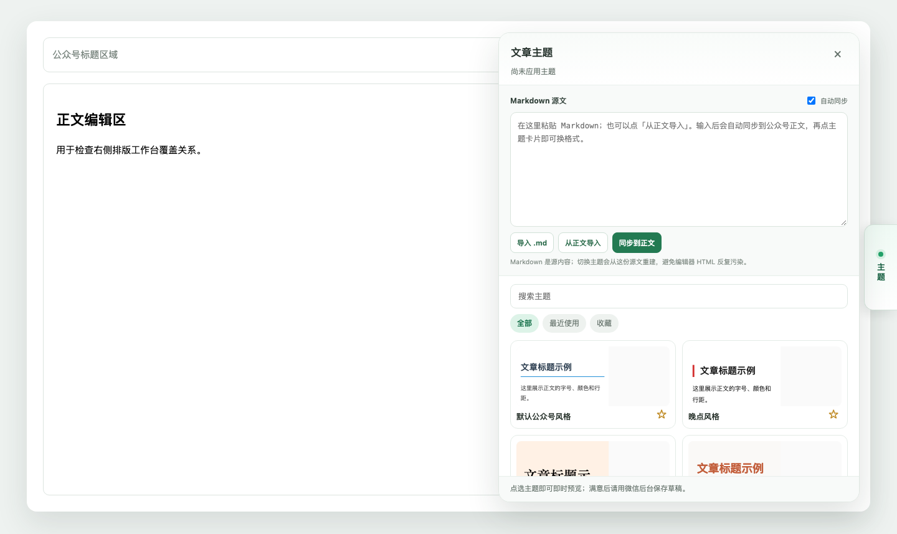

# WeChat Theme Switcher · 公众号 Markdown 排版主题

GitHub: <https://github.com/powcai001/wechat-theme-switcher>

一个在微信公众号编辑页内使用的 Chrome / Edge 扩展：把 Markdown 作为源文稿，一键重建正文排版并切换主题。你不需要在花生编辑器和公众号后台之间来回复制粘贴。

当前版本：**v0.8.2 Developer Preview**  
当前暂不上架 Chrome Web Store / Edge Add-ons，推荐使用下面的 **离线安装方式**。



## 它解决什么问题

写公众号文章时，常见流程是：

1. 在本地或另一个编辑器里写 Markdown；
2. 粘贴到排版工具；
3. 选择主题；
4. 复制到公众号；
5. 发现想换主题，再回排版工具重新复制。

这个插件把第 2～4 步搬进公众号编辑页：

```text
Markdown 源文
→ markdown-it 生成干净 HTML
→ 应用主题
→ 写入公众号正文
→ 第一个 H1 自动写入公众号标题
```

Markdown 是源内容。切换主题时始终从同一份 Markdown 重建正文，避免旧主题样式、编辑器残留 HTML 或复制粘贴过程污染下一版排版。

## 核心功能

- 右侧边缘「主题排版」入口，点开后打开约 580px 宽的排版工作台。
- 支持 `.md` 文件导入、拖拽导入、粘贴编辑、从公众号正文导入。
- 默认自动同步：停止输入约 0.6 秒后写入正文。
- Markdown 第一个一级标题自动写入公众号标题输入框，并从正文中移除。
- 内置花生编辑器主题定义，支持搜索、最近使用和收藏。
- 连续切换主题时不残留上一个主题的 HTML、class 或行内样式。
- 代码块使用显式 `<br>` 保留换行，并通过公众号兼容的 `<pre><code>` 输出。
- 连续多图会转换为公众号兼容的 Table 布局。
- 任务列表渲染为复选框。
- 异常多列表头可自动拆分。
- 列表内粗体、斜体、链接、行内代码等行内格式会被保留。

## 离线安装

### 方式一：下载 Release 包安装

1. 打开 [Releases](https://github.com/powcai001/wechat-theme-switcher/releases)。
2. 下载最新版本的 `wechat-theme-switcher-v*.zip`。
3. 解压 Zip，得到 `wechat-theme-switcher` 目录。
4. 打开浏览器的扩展管理页：
   - Chrome：地址栏输入 `chrome://extensions`
   - Edge：地址栏输入 `edge://extensions`
5. 打开「开发者模式」。
6. 点击「加载已解压的扩展程序」。
7. 选择解压后的 `wechat-theme-switcher` 目录，即包含 `manifest.json` 的目录。
8. 打开微信公众号文章编辑页并刷新。
9. 页面右侧中间会出现「主题排版」按钮。

### 方式二：克隆源码安装

适合愿意持续更新的用户：

```bash
git clone https://github.com/powcai001/wechat-theme-switcher.git
cd wechat-theme-switcher
```

然后执行和上面相同的浏览器步骤：打开扩展管理页 → 开启开发者模式 → 加载已解压的扩展程序 → 选择仓库根目录。

### 更新

#### Release 安装

1. 下载新的 Release Zip；
2. 解压并替换旧目录；
3. 在扩展管理页点击本插件的「重新加载」；
4. 刷新公众号编辑页。

#### Git 安装

```bash
git pull
```

然后同样在扩展管理页点击「重新加载」，并刷新公众号编辑页。

### 常见问题

- **浏览器提示“请停用开发者模式扩展程序”怎么办？**  
  这是因为当前采用离线开发者模式安装，不是商店安装。这是 Chrome / Edge 对所有未上架扩展的通用提示。确认代码来源可信后可以继续使用。

- **为什么 GitHub 下载的源码 Zip 不能直接拖入浏览器？**  
  浏览器需要的是一个已解压的目录，并且该目录里必须包含 `manifest.json`。请先解压，再选择目录。

- **找不到「加载已解压的扩展程序」怎么办？**  
  先确认已打开「开发者模式」。Edge 通常在左侧或右上角的设置区域，Chrome 在扩展管理页右上角。

- **安装后公众号页面没有按钮怎么办？**  
  确认当前地址是公众号文章编辑页，并刷新页面。插件只注入 `https://mp.weixin.qq.com/cgi-bin/appmsg*`，不会在公众号首页运行。

## 日常使用

1. 点击右侧「主题排版」。
2. 点击「导入 .md」选择 Markdown 文件，或直接把 `.md` 文件拖到输入框。
3. 插件自动同步正文；第一个一级标题会写入公众号标题。
4. 点选主题卡片切换排版。
5. 使用公众号自己的「保存草稿」。

更完整的说明见 [INSTALL.md](INSTALL.md)。

## 隐私说明

详见 [PRIVACY.md](PRIVACY.md)。

简要原则：

- 不上传文章内容；
- 不内置统计埋点；
- 不请求第三方 AI 或排版 API；
- Markdown 源文、最近使用和收藏只保存在浏览器本地扩展存储；
- 扩展只在 `https://mp.weixin.qq.com/cgi-bin/appmsg*` 路径注入。

## 当前限制

- 微信编辑器 DOM 属于未公开实现，页面改版可能导致正文识别失败。
- 标题输入框识别已做常见结构兼容，但真实页面仍需持续验证。
- LaTeX 数学公式暂按普通文本处理。
- `[IMAGE:...]` 不是 Markdown 标准图片语法，会提示改为 ``。
- 不自动保存、不自动群发、不代替用户点击公众号发布按钮。
- 图片上传仍使用公众号编辑器自身能力。

## 开发

```bash
node --check content.js
python3 -m json.tool manifest.json
```

测试素材见 [tests/fixtures/comprehensive.md](tests/fixtures/comprehensive.md)。

## 后续路线

详见 [ROADMAP.md](ROADMAP.md)。

当前优先级：

1. 真实公众号草稿完整回归；
2. 标题输入框识别加固；
3. 手动编辑正文与 Markdown 源文的冲突提示；
4. 长文章性能与撤销 / 重做测试；
5. 稳定后再准备商店上架。

## 第三方说明

主题定义来自 [alchaincyf/huasheng_editor](https://github.com/alchaincyf/huasheng_editor)，MIT License。  
Markdown 管线使用 Turndown 和 markdown-it，均为 MIT License，已本地打包。详见 [THIRD_PARTY_NOTICES.md](THIRD_PARTY_NOTICES.md)。

## License

MIT License. See [LICENSE](LICENSE).
